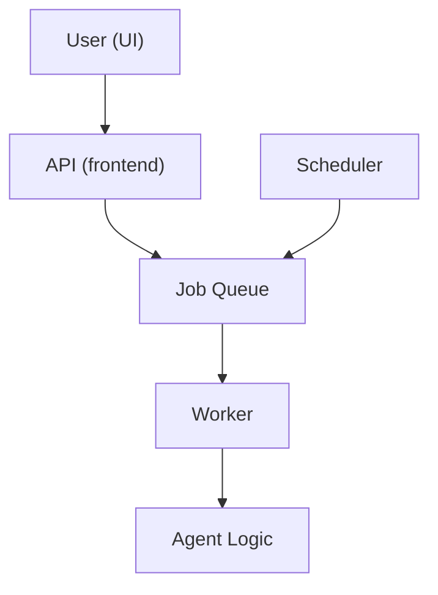

# 📈 Business Overview: EverestHood/AgentForge

> **See also:** [DOCKER_DEPLOYMENT.md](./DOCKER_DEPLOYMENT.md) | [TECHNICAL_GUIDE.md](./TECHNICAL_GUIDE.md) | [SYSTEM_OVERVIEW.md](./SYSTEM_OVERVIEW.md) | [TROUBLESHOOTING.md](./TROUBLESHOOTING.md)

---

## What is EverestHood/AgentForge?
- **Layman:** A smart platform that lets you automate tasks and get things done by creating and running digital agents.
- **Business:** A unified, scalable system for automating workflows, integrating data, and enabling both user-triggered and scheduled actions.
- **Technical:** A full-stack, containerized platform with modular agent logic, job queueing, and robust scheduling.

---

## Key User Flows

- **Layman:** You click a button or set a schedule, and the system does the rest.
- **Business:** All actions—manual or scheduled—are processed the same way, ensuring reliability and auditability.

---

## What's New in This Release?
- **Layman:** Everything runs in containers (Docker), so it's easy to set up and works the same everywhere.
- **Business:**
  - Dockerization for consistent deployment
  - Unified agent execution (no code duplication)
  - Built-in scheduling for recurring tasks
  - Centralized logging and monitoring
- **Technical:**
  - Redis-powered job queue
  - BullMQ for job management
  - Scheduler service for cron-based automation

---

## Requesting Features & Reporting Issues
- **Layman:** Want something new or found a bug? Let us know!
- **Business:**
  - Open an issue on GitHub
  - Contact the product owner or support team
- **Technical:**
  - [GitHub Issues](https://github.com/your-org/your-repo/issues)

---

## Contact & Support
- Product Owner: [name/email]
- Support: [support@email.com]
- Slack: #agentforge-support

---

## Cross-Links
- [Deployment Guide](./DOCKER_DEPLOYMENT.md)
- [Technical Guide](./TECHNICAL_GUIDE.md)
- [System Overview](./SYSTEM_OVERVIEW.md)
- [Troubleshooting](./TROUBLESHOOTING.md) 