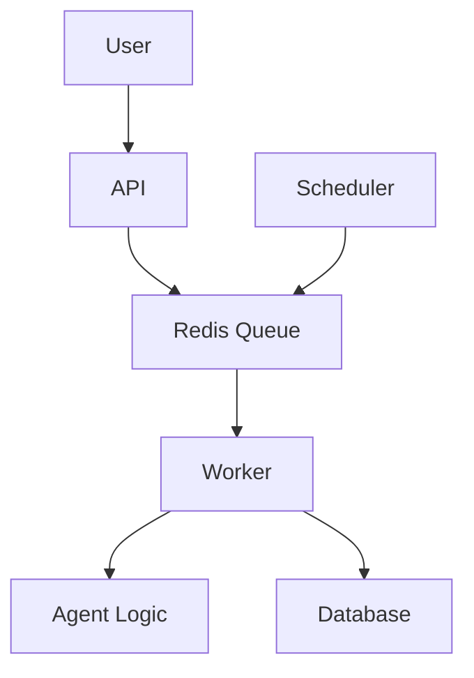

# 🏔️ System Overview: EverestHood/AgentForge

> **See also:** [DOCKER_DEPLOYMENT.md](./DOCKER_DEPLOYMENT.md) | [TECHNICAL_GUIDE.md](./TECHNICAL_GUIDE.md) | [BUSINESS_OVERVIEW.md](./BUSINESS_OVERVIEW.md) | [TROUBLESHOOTING.md](./TROUBLESHOOTING.md)

---

## What is EverestHood/AgentForge?
- **Layman:** A digital assistant factory—create, schedule, and run smart agents to automate your work.
- **Business:** A platform for scalable, reliable automation, supporting both on-demand and scheduled workflows.
- **Technical:** A Dockerized, full-stack system with unified job queueing, modular agent logic, and robust scheduling.

---

## Key Features & Differentiators
- Unified agent execution (no code duplication)
- Dockerized for easy deployment
- Real-time and scheduled automation
- Modular, extensible agent logic
- Centralized logging and monitoring
- Scalable architecture

---

## One-Pager System Diagram

---

## Unified Execution Flow
- **Layman:** Whether you click a button or set a schedule, the system runs your agent the same way.
- **Business:** All agent runs—manual or scheduled—are processed through the same queue and worker, ensuring reliability and auditability.
- **Technical:** Both API and scheduler enqueue jobs to Redis; the worker consumes jobs and runs agent logic, persisting results to Postgres.

---

## Cross-Links
- [Deployment Guide](./DOCKER_DEPLOYMENT.md)
- [Technical Guide](./TECHNICAL_GUIDE.md)
- [Business Overview](./BUSINESS_OVERVIEW.md)
- [Troubleshooting](./TROUBLESHOOTING.md) 