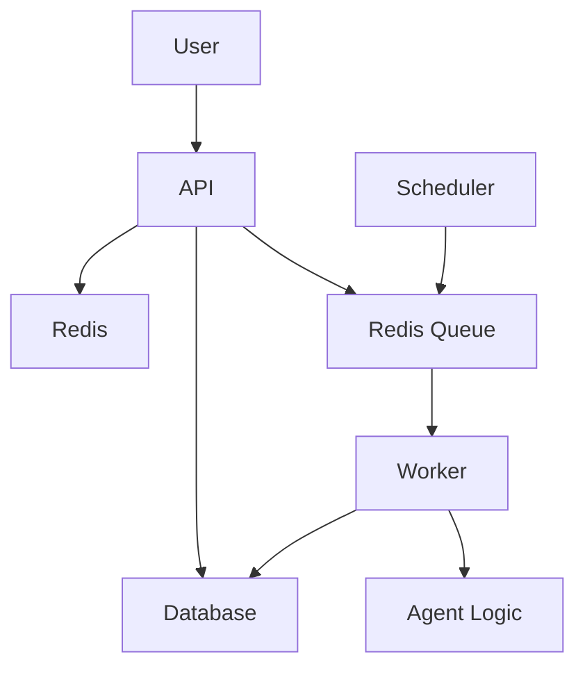

# 🏔️ System Overview: EverestHood/AgentForge

> **See also:** [DOCKER_DEPLOYMENT.md](./DOCKER_DEPLOYMENT.md) | [TECHNICAL_GUIDE.md](./TECHNICAL_GUIDE.md) | [BUSINESS_OVERVIEW.md](./BUSINESS_OVERVIEW.md) | [TROUBLESHOOTING.md](./TROUBLESHOOTING.md)

---

## What is EverestHood/AgentForge?
- **Layman:** A digital assistant factory—create, schedule, and run smart agents to automate your work and life.
- **Business:** A SaaS platform for scalable, reliable automation, social learning, and creator monetization, supporting both on-demand and scheduled workflows.
- **Technical:** A Dockerized, full-stack system with unified job queueing, modular agent logic, robust scheduling, and modern cloud infrastructure.

---

## Key Features & Differentiators
- Unified agent execution (no code duplication)
- Dockerized for easy deployment
- Real-time and scheduled automation
- Modular, extensible agent and feature logic
- Centralized logging and monitoring
- Scalable, multi-tenant architecture
- Social, gamified, and monetized modules

---

## Feature Catalog
- AI Personas & Summaries
- News & Content Curation
- Social Community (Posts, Friends, Circles)
- Achievements & Gamification
- Job Board & Resume Tools
- Payments, Tipping, and Subscriptions
- Family, Money, Health, Productivity Modules
- Notifications, Admin, and Moderation

---

## Automated Fix Scripts & System Reliability
- Node.js scripts in project root for linting, migration, import fixes, and MUI refactors
- Run all: `npm run fix:all`
- Integrate with CI/CD and pre-commit hooks for best results

---

## One-Pager System Diagram

---

## Unified Execution Flow
- **Layman:** Whether you click a button or set a schedule, the system runs your agent the same way.
- **Business:** All agent runs—manual or scheduled—are processed through the same queue and worker, ensuring reliability and auditability.
- **Technical:** Both API and scheduler enqueue jobs to Redis; the worker consumes jobs and runs agent logic, persisting results to Postgres.

---

## Best Practices & Creativity
- Modularize agent and API logic for easy extension
- Use fix scripts regularly to maintain code health
- Encourage creative agent use cases (summarization, moderation, notifications, etc.)
- Document new features and patterns for the community

---

## Cross-Links
- [Deployment Guide](./DOCKER_DEPLOYMENT.md)
- [Technical Guide](./TECHNICAL_GUIDE.md)
- [Business Overview](./BUSINESS_OVERVIEW.md)
- [Troubleshooting](./TROUBLESHOOTING.md) 