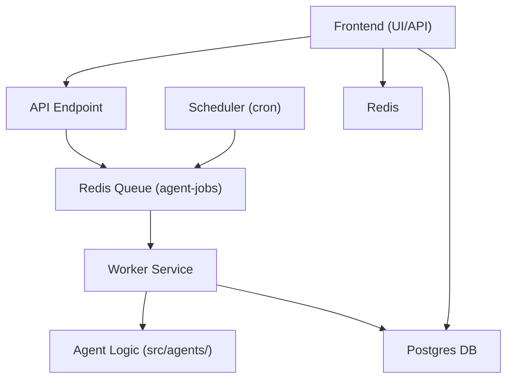

# 🛠️ Technical Guide: EverestHood/AgentForge

> **See also:** [DOCKER_DEPLOYMENT.md](./DOCKER_DEPLOYMENT.md) | [BUSINESS_OVERVIEW.md](./BUSINESS_OVERVIEW.md) | [SYSTEM_OVERVIEW.md](./SYSTEM_OVERVIEW.md) | [TROUBLESHOOTING.md](./TROUBLESHOOTING.md)

---

## 1. System Architecture



- **Layman:** The system is like a restaurant: users place orders (jobs), a kitchen (worker) cooks them, and a scheduler can place orders automatically.
- **Business:** All agent executions—manual or scheduled—use the same queue and worker, ensuring reliability and scalability.
- **Technical:** Both API and scheduler enqueue jobs to Redis; the worker consumes jobs and runs agent logic, persisting results to Postgres.

---

## 2. Service Breakdown

| Service    | Description |
|------------|-------------|
| frontend   | Next.js app (UI & API) |
| worker     | Processes jobs from Redis queue |
| scheduler  | Triggers scheduled agent runs |
| postgres   | Database |
| redis      | Caching & job queue |
| kong       | API gateway |
| auth       | GoTrue authentication |
| realtime   | Realtime events |
| storage    | MinIO file storage |

---

## 3. Environment Setup, Build, and Run

- **Layman:** Copy the example settings, fill in your secrets, and run one command to start everything.
- **Business:** Fast onboarding for new devs; all dependencies are containerized.
- **Technical:**
  ```bash
  cp .env.example .env
  # Edit .env as needed
  docker-compose up --build
  ```

---

## 4. Adding/Editing Agents

- **Layman:** To add a new agent, just write a new file in `src/agents/`.
- **Business:** Agents are modular and easy to extend; no changes to the worker or API needed.
- **Technical:**
  1. Create a new file in `src/agents/` (e.g., `myAgent.ts`).
  2. Export a `run` function:
     ```ts
     // Layman: This agent repeats what you send it.
     // Business: Demo agent for testing.
     // Technical: Implements the required run interface.
     export async function run(input: any, mode: string, userId: string) {
       return { result: 'Agent completed', input, mode, userId };
     }
     ```
  3. Register the agent in `src/agents/registry.ts`:
     ```ts
     // Layman: Add your agent to the phonebook.
     // Business: Ensures discoverability.
     // Technical: Maps agent ID to import function.
     'myAgent': () => import('./myAgent'),
     ```

---

## 5. Database Migration & Schema Updates

- **Layman:** If you change the database, run a command to update it.
- **Business:** Schema changes are versioned and easy to apply.
- **Technical:**
  ```bash
  docker-compose exec frontend npx prisma migrate dev
  ```

---

## 6. Monitoring, Logging, and Debugging

- **Layman:** Use logs to see what's happening.
- **Business:** Centralized logs for all services.
- **Technical:**
  - View all logs: `docker-compose logs -f`
  - View a specific service: `docker-compose logs -f worker`
  - Connect to Postgres: `docker-compose exec postgres psql -U user everesthood`
  - Connect to Redis: `docker-compose exec redis redis-cli`

---

## 7. QA Validation Checklist

- See [QA_VALIDATION_SIGNOFF.md](./QA_VALIDATION_SIGNOFF.md) for the full checklist and sign-off template.

---

## 8. Cross-Links
- [Deployment Guide](./DOCKER_DEPLOYMENT.md)
- [Business Overview](./BUSINESS_OVERVIEW.md)
- [System Overview](./SYSTEM_OVERVIEW.md)
- [Troubleshooting](./TROUBLESHOOTING.md) 