# 📐 EverestHood Architecture & Diagrams

## System Architecture

```mermaid
graph TB
    Client[Client Browser] --> Next[Next.js App Router]
    Next --> API[API Routes]
    Next --> Pages[Pages]
    Next --> Components[Components]
    
    API --> Auth[Auth Service]
    API --> DB[Database]
    API --> Cache[Redis Cache]
    API --> Queue[Job Queue]
    
    Auth --> NextAuth[NextAuth.js]
    NextAuth --> OAuth[OAuth Providers]
    
    DB --> Prisma[Prisma ORM]
    Prisma --> Postgres[PostgreSQL]
    
    Cache --> Redis[Redis]
    Queue --> BullMQ[BullMQ]
    BullMQ --> Redis
```

## Data Flow

## Component Architecture

## Authentication Flow

## Database Schema

## State Management

## Deployment Architecture

## Queue System

## Search Architecture

## Error Handling Flow

These diagrams provide visual representations of:
1. Overall system architecture
2. Data flow between components
3. Component hierarchy
4. Authentication process
5. Database relationships
6. State management
7. Deployment pipeline
8. Queue system
9. Search functionality
10. Error handling

Would you like me to:
1. Add more specific technical diagrams?
2. Create workflow diagrams for specific features?
3. Add sequence diagrams for complex operations?
4. Create visual guides for the development process?
