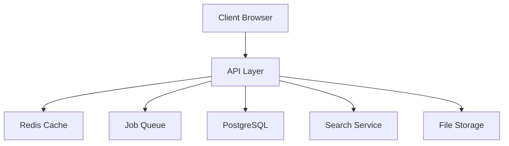

# 📚 EverestHood Documentation

## Table of Contents
1. [Architecture Overview](#architecture-overview)
2. [Development Setup](#development-setup)
3. [Code Standards](#code-standards)
4. [Testing Strategy](#testing-strategy)
5. [Security Guidelines](#security-guidelines)
6. [Performance Optimization](#performance-optimization)
7. [Monitoring & Alerting](#monitoring--alerting)
8. [Deployment Process](#deployment-process)
9. [Error Handling](#error-handling)
10. [PWA Features](#pwa-features)

## Architecture Overview

### Core Technologies
- Next.js 13 (App Router)
- TypeScript
- Prisma ORM
- PostgreSQL
- Redis
- BullMQ
- TailwindCSS
- TRPC
- NextAuth.js

### System Architecture


## Development Setup

1. Prerequisites
```bash
node >= 18
pnpm >= 8
postgres >= 14
redis >= 6
```

2. Initial Setup
```bash
# Clone repository
git clone https://github.com/sprasains/everesthood.git
cd everesthood

# Install dependencies
pnpm install

# Setup environment
cp .env.example .env.local

# Initialize database
pnpm prisma generate
pnpm prisma db push

# Start development server
pnpm dev
```

## Code Standards

### TypeScript Configuration
```json
{
  "compilerOptions": {
    "target": "es2022",
    "lib": ["dom", "dom.iterable", "esnext"],
    "allowJs": true,
    "skipLibCheck": true,
    "strict": true,
    "forceConsistentCasingInFileNames": true,
    "noEmit": true,
    "esModuleInterop": true,
    "module": "esnext",
    "moduleResolution": "node",
    "resolveJsonModule": true,
    "isolatedModules": true,
    "jsx": "preserve",
    "incremental": true,
    "plugins": [
      {
        "name": "next"
      }
    ],
    "paths": {
      "@/*": ["./src/*"]
    }
  }
}
```

### Code Style Guide
```typescript
// Use proper type annotations
interface User {
  id: string;
  email: string;
  role: UserRole;
}

// Use zod for validation
const userSchema = z.object({
  email: z.string().email(),
  password: z.string().min(8),
});

// Use proper error handling
try {
  const user = await createUser(data);
  return user;
} catch (error) {
  if (error instanceof Prisma.PrismaClientKnownRequestError) {
    handlePrismaError(error);
  }
  throw error;
}
```

## Testing Strategy

### Unit Tests
```typescript
describe('UserService', () => {
  it('creates user with valid data', async () => {
    const data = {
      email: 'test@example.com',
      password: 'password123'
    };
    
    const user = await createUser(data);
    expect(user).toHaveProperty('id');
  });
});
```

### Integration Tests
```typescript
describe('Auth API', () => {
  it('handles sign in', async () => {
    const response = await caller.auth.signIn({
      email: 'test@example.com',
      password: 'password123'
    });
    
    expect(response).toHaveProperty('token');
  });
});
```

### E2E Tests
```typescript
test('complete auth flow', async ({ page }) => {
  await page.goto('/');
  await page.click('text=Sign In');
  await page.fill('[name=email]', 'test@example.com');
  await page.click('button[type=submit]');
  await expect(page).toHaveURL('/dashboard');
});
```

## Security Guidelines

### API Security
1. Input Validation
```typescript
const inputSchema = z.object({
  email: z.string().email(),
  password: z.string().min(8),
});

// Validate input
const validated = inputSchema.parse(req.body);
```

2. Authentication
```typescript
export const protectedProcedure = t.procedure.use(isAuthed);
```

3. Rate Limiting
```typescript
const limiter = rateLimit({
  windowMs: 15 * 60 * 1000,
  max: 100
});
```

4. CORS Configuration
```typescript
const corsOptions = {
  origin: process.env.ALLOWED_ORIGINS.split(','),
  methods: ['GET', 'POST', 'PUT', 'DELETE'],
  allowedHeaders: ['Content-Type', 'Authorization'],
};
```

## Performance Optimization

### Caching Strategy
```typescript
// API route caching
export const revalidate = 60; // 1 minute

// Redis caching
const cached = await redis.get(cacheKey);
if (cached) return JSON.parse(cached);

const data = await getData();
await redis.set(cacheKey, JSON.stringify(data), 'EX', 3600);
```

### Image Optimization
```typescript
import Image from 'next/image';

<Image
  src={src}
  alt={alt}
  width={width}
  height={height}
  placeholder="blur"
  loading="lazy"
/>
```

## Monitoring & Alerting

### Metrics Collection
```typescript
await monitoring.recordMetric({
  name: 'api_response_time',
  value: duration,
  tags: {
    path: req.url,
    method: req.method,
  },
});
```

### Error Tracking
```typescript
try {
  await operation();
} catch (error) {
  await monitoring.recordError(error, {
    context: 'operation_name',
    user: req.user.id,
  });
}
```

## Deployment Process

### Production Deployment
1. Build and test
```bash
pnpm build
pnpm test
```

2. Database migrations
```bash
pnpm prisma migrate deploy
```

3. Deploy
```bash
pnpm deploy
```

### Monitoring Deployment
1. Check application health
2. Monitor error rates
3. Check performance metrics
4. Verify database migrations
5. Test critical user flows

## Error Handling

### Global Error Boundary
```typescript
export class ErrorBoundary extends React.Component {
  componentDidCatch(error: Error, errorInfo: React.ErrorInfo) {
    monitoring.recordError(error, errorInfo);
  }
}
```

### API Error Handling
```typescript
try {
  // Operation
} catch (error) {
  if (error instanceof Prisma.PrismaClientKnownRequestError) {
    handlePrismaError(error);
  }
  throw new TRPCError({
    code: 'INTERNAL_SERVER_ERROR',
    message: 'Something went wrong',
  });
}
```

## PWA Features

### Service Worker Registration
```typescript
if ('serviceWorker' in navigator) {
  window.addEventListener('load', () => {
    navigator.serviceWorker.register('/sw.js');
  });
}
```

### Offline Support
```typescript
// Cache static assets
self.addEventListener('install', (event) => {
  event.waitUntil(
    caches.open('static-v1').then((cache) => {
      return cache.addAll([
        '/',
        '/offline',
        '/manifest.json',
      ]);
    })
  );
});
```

### Push Notifications
```typescript
self.addEventListener('push', (event) => {
  const data = event.data.json();
  self.registration.showNotification(data.title, {
    body: data.body,
    icon: '/icon.png',
  });
});
```

## Additional Resources

### Useful Links
- [API Documentation](/docs/API.md)
- [Database Schema](/docs/SCHEMA.md)
- [Testing Guide](/docs/TESTING.md)
- [Security Guide](/docs/SECURITY.md)
- [Performance Guide](/docs/PERFORMANCE.md)
- [PWA Guide](/docs/PWA.md)

### Tools and Extensions
- [VS Code Configuration](/docs/VSCODE.md)
- [Git Hooks](/docs/GIT_HOOKS.md)
- [CI/CD Pipeline](/docs/CICD.md)

### Troubleshooting
- [Common Issues](/docs/TROUBLESHOOTING.md)
- [Error Codes](/docs/ERROR_CODES.md)
- [Debug Guide](/docs/DEBUG_GUIDE.md)
