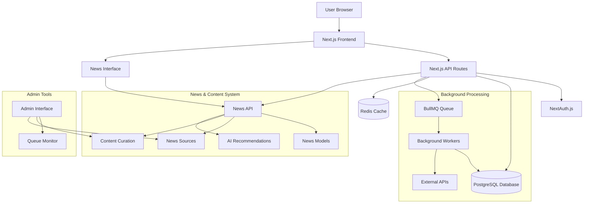

# System Overview — EverestHood Platform

## Core Architecture

High-level components:

- **Frontend (Next.js)** — React-based UI with Material-UI components and TailwindCSS styling
- **API Layer (Next.js)** — RESTful API routes with authentication and validation
- **Database (PostgreSQL)** — Prisma ORM with comprehensive data models
- **Authentication (NextAuth.js)** — OAuth and session-based authentication
- **Queue System (Redis/BullMQ)** — Background job processing and scheduling
- **Content Management** — News aggregation, RSS feeds, and content curation
- **AI Integration** — Personalized recommendations and content processing

## News & Content Curation System

- **News Sources** — RSS, API, manual, and scraped content aggregation
- **Content Processing** — Article parsing, categorization, and sentiment analysis
- **Personalization Engine** — AI-powered recommendations based on user preferences
- **Curation Tools** — Admin interface for featuring and trending content
- **User Engagement** — Likes, shares, bookmarks, and interaction tracking

## System Architecture Diagram

## Data Flow

1. **User Interaction** → Frontend components handle user actions
2. **API Requests** → Next.js API routes process requests with authentication
3. **Database Operations** → Prisma ORM handles data persistence
4. **Background Jobs** → BullMQ processes long-running tasks
5. **Content Aggregation** → News sources provide content via RSS/API
6. **Personalization** → AI algorithms provide personalized recommendations
7. **Curation** → Admin tools manage content quality and featuring
